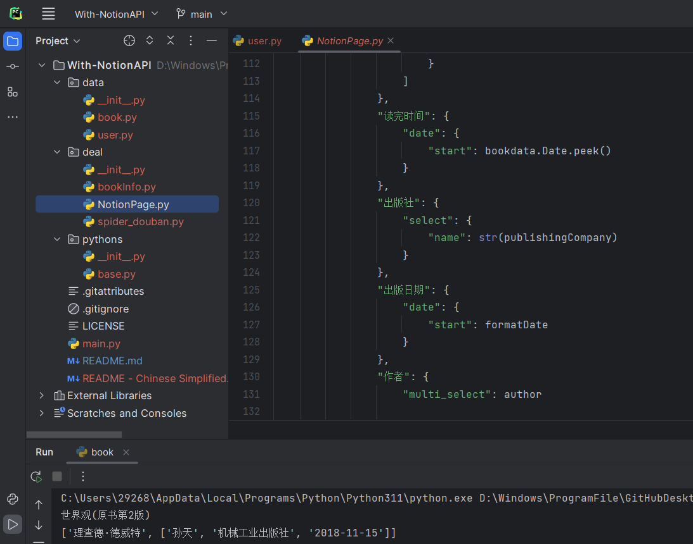

# With-NotionAPI
> Saving data of the books and videos data to notion page with Python . 

>使用Python将图书和影视数据存放入Notion中。

---
# 🗣️语言  
[English](./README.md)

[中文简体](./README - Chinese Simplified)

# 🎈注意

该项目处于测试阶段，所以我并不敢保证它能够在你的电脑上良好运行。其次，我也正在完善功能。如果你有发现什么问题并且愿意告诉我，我很愿意解决它。谢谢！

# 🖼️环境

- Python 3.9+
- PyCharm 2021+

# 🤖行动

## 1. 准备阶段

拥有[豆瓣](https://www.douban.com/)和[Notion](https://www.notion.so/)账户。

## 2. 修改必要数据

首先，修改一些必要网站和[Notion API](https://developers.notion.com/)的必要参数。网站：“[豆瓣网](https://www.douban.com/)”的URL和Cookie。Notion API的Token和数据（页面）ID。

然后，修改书籍的默认信息，如评分、状态、书籍分类（电子书/纸质书或有声书）、书评以及书摘。

## 3. 文件信息

- data
  - user.py
  - book.py
- deal
  - bookInfo.py
  - NotionPage.py
  - spider_douban.py
- pythons
  - base.py

user.py 顾名思义——存放用户数据。

book.py 使其它文件引用书籍数据。

bookInfo.py 处于测试阶段。

spider_douban.py 是爬取数据的主要方法。

NotionPage.py 是目前存储数据和运行的主要文件

pythons包下的文件为Stack（栈）和Queue（队列）的实现方法。

## 4. 运行

你必须通过[第二步](#2. 修改必要数据)后才能完成运行NotionPage.py

# 🎗️For Example

<iframe src="//player.bilibili.com/player.html?aid=396756725&bvid=BV15o4y1W7hw&cid=1075028392&page=1" scrolling="no" border="0" frameborder="no" framespacing="0" allowfullscreen="true"> </iframe>

# 🔗其它链接

[创建 Notion API](https://www.notion.so/my-integrations)
