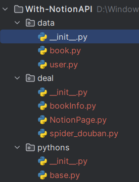
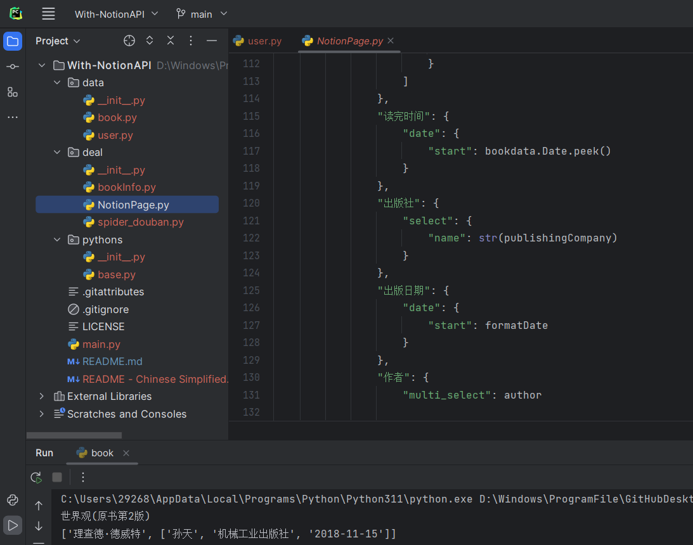
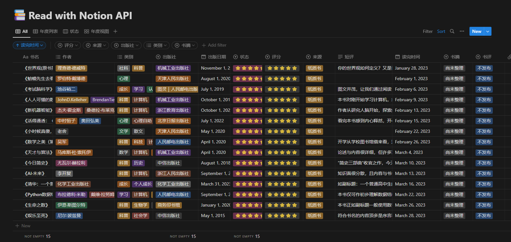

# With-NotionAPI
> Saving data of the books and videos data to notion page with Python . 

>使用Python将图书和影视数据存放入Notion中。

# 🗣️Language  

[English](./README.md)

[中文简体](./README - Chinese Simplified)

# 🖼️Environment

- Python 3.9+
- PyCharm 2021+

# 🎈Attention

The progarmming is during test phase, so I not sure it can greate running to you. Furthermore, I am also trying build better function. If you have discover some problems in it programming and you be willing told to me, while I am very will to solving its. Think you!

# 🤖Action

## 1. Ready

Have two account, them is "[Douban](https://www.douban.com/)" and [Notion](https://www.notion.so/).

## 2. Modify Necessarily Data

A begin with, modify some necessarily data that are website and Notion API. For webiste, it is "[Douban](https://www.douban.com/)"(it is platform of remark books and film s) both  URL and Cookie. For [Notion API](https://developers.notion.com/), it is both token and id of database or pages.

In addtion, modify other defaults data about book is star, status, bookCategory, bookRemark and bookExcerpt. 

## 3. About Code Files

- data
  - user.py
  - book.py
- deal
  - bookInfo.py
  - NotionPage.py
  - spider_douban.py
- pythons
  - base.py

Accoding to the user.py can know it save data and function.

book.py for other python files to quote data.

bookInfo.py during testing.

spider_douban.py is main function of  spider website.

At present saving data and running main file is NotionPage.py.

In pythons packages under file is Stack and Queue. 

## 4. Running

You must go throught  [Second Step](#2. Modify Necessarily Data)  can complete running NotionPage.py.

# 🎗️For Example

<iframe src="//player.bilibili.com/player.html?aid=396756725&bvid=BV15o4y1W7hw&cid=1075028392&page=1" scrolling="no" border="0" frameborder="no" framespacing="0" allowfullscreen="true"> </iframe>

[With Notion API——Contain data of the books and videos in Douban website and that update into Notion database_bilibili](https://www.bilibili.com/video/BV15o4y1W7hw/?spm_id_from=333.999.0.0)

# 🔗Other Link

[Create Notion API](https://www.notion.so/my-integrations)
